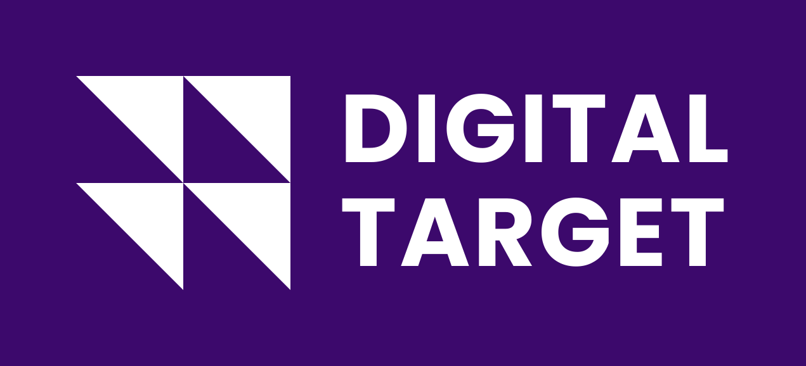
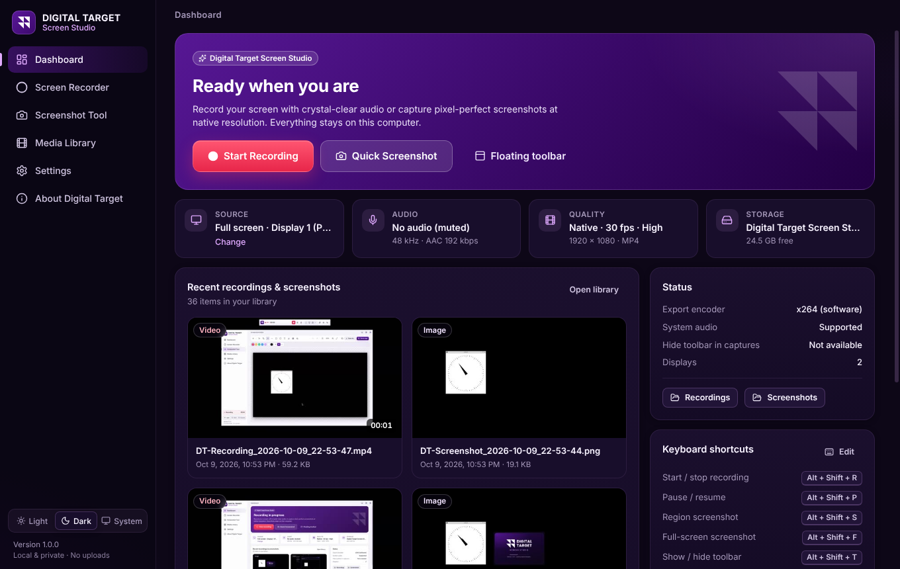
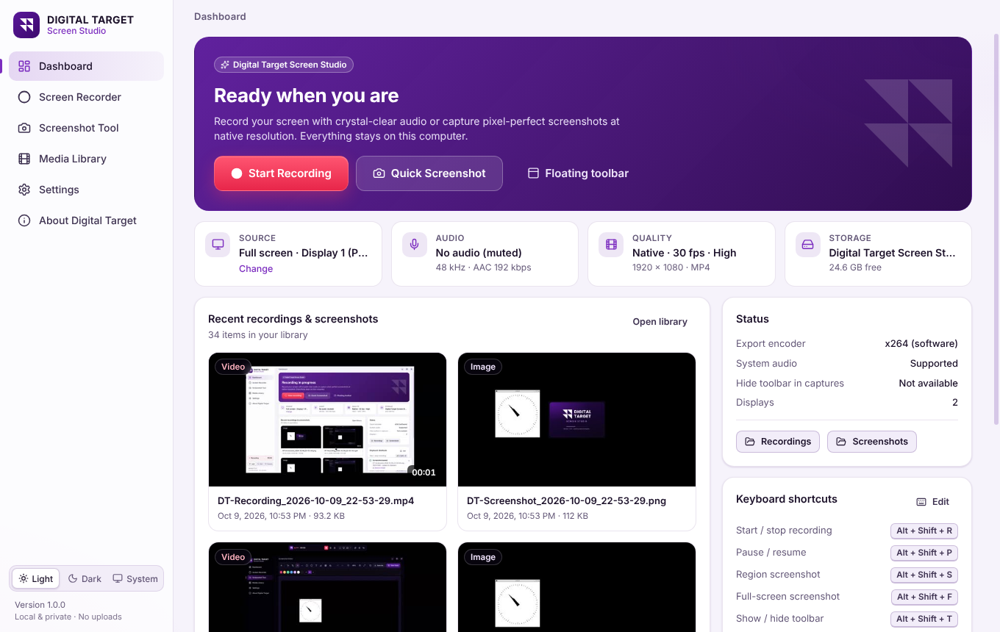
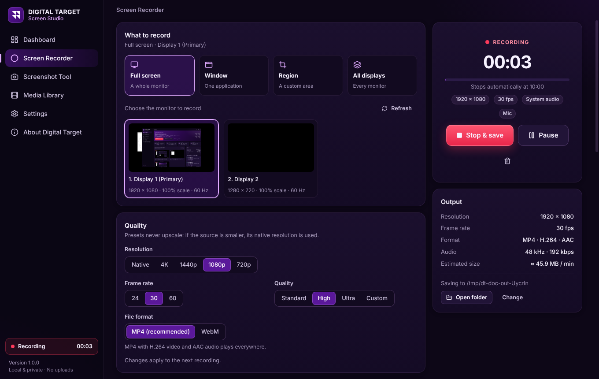
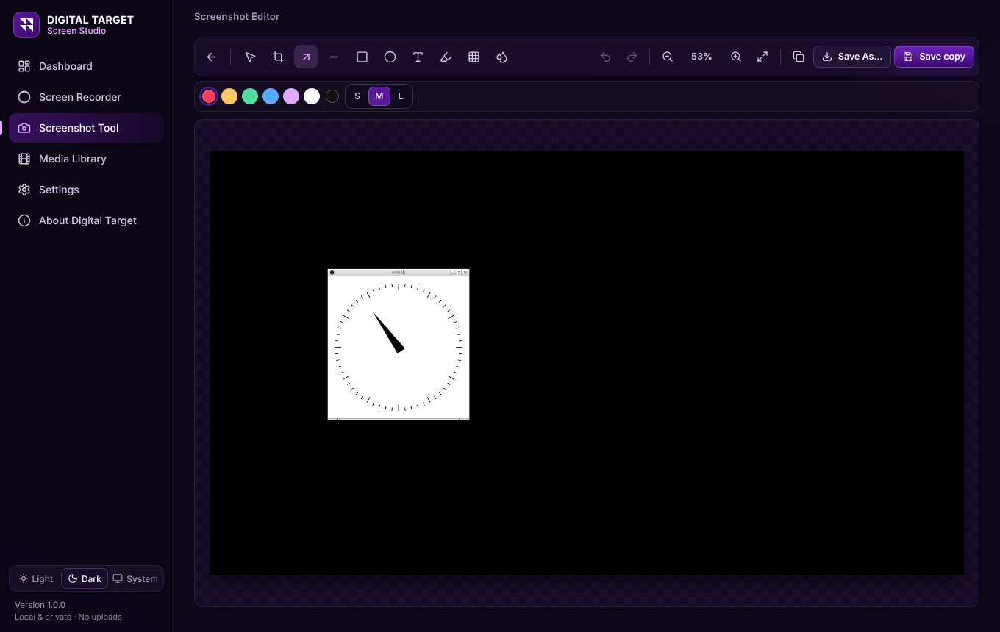
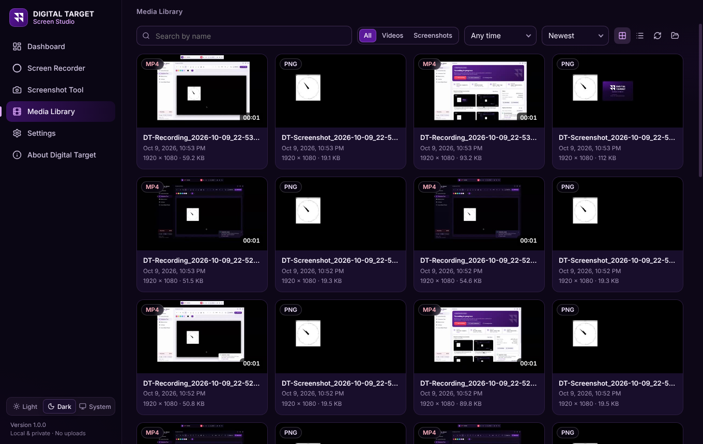
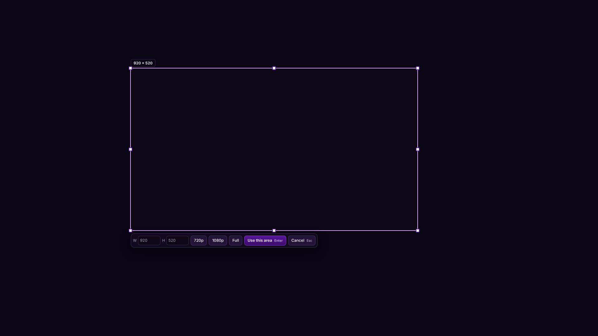
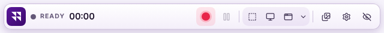
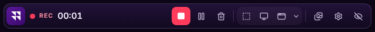

<p align="center">
  
</p>

<h1 align="center">Digital Target Screen Studio</h1>

<p align="center">Professional screen recorder and screenshot studio for Windows 10 and 11 — by <strong>Digital Target</strong>.<br/>
Fully offline. No accounts, no uploads, no telemetry.</p>



---

## Contents

- [Features](#features)
- [Installing (end users)](#installing-end-users)
- [Building from source](#building-from-source)
- [Project structure & architecture](#project-structure--architecture)
- [Testing](#testing)
- [Hardware, Windows and driver requirements](#hardware-windows-and-driver-requirements)
- [Troubleshooting](#troubleshooting)
- [Privacy & security](#privacy--security)
- [Branding](#branding)
- [Licensing & third-party software](#licensing--third-party-software)

## Features

### Screen recording
- **Full screen / a specific monitor**, **an application window**, a **custom region** (drag-select with pixel inputs and 720p/1080p presets), or **all monitors combined** into one video.
- Single and multi-monitor setups, any DPI scaling (mixed-DPI layouts are composed in physical pixels).
- **Start, pause, resume, stop**, recording timer and status, configurable **countdown** (off/3/5/10/custom).
- **Duration limits**: unlimited, presets (1 min … 2 h) or custom h:m:s — the recording **stops and saves automatically**.
- Quality presets **720p, 1080p, 1440p, 4K (2160p), Native**, at **24 / 30 / 60 fps**, with Standard / High / Ultra / custom bitrate.
  Presets **never upscale**: a 1080p display recorded with the 4K preset is recorded at its real 1920×1080 and the UI says so.
  Outputs are kept within H.264 limits (≤ 4096 px wide, ~8.9 MP) and the UI explains when scaling was needed.
- **MP4 (H.264 + AAC)** by default; optional **WebM (VP9 + Opus)**; optional **constant frame rate** for video editors.
- Keeps recording when the window is minimised or hidden to the tray; minimise-to-tray while recording.
- **Floating toolbar** (slim, draggable, always on top, remembers its position, show/hide with Alt+Shift+T): Record, Pause/Resume, Stop, Discard; one-click **Region / Full-screen / Window screenshots** plus a menu with All displays, the screenshot countdown (none / 3 / 5 / 10 s, shown on the toolbar when set), copy-to-clipboard, the Screenshot Tool and the screenshots folder; Library, Settings, Hide; elapsed time, mic level, and a progress bar for time-limited recordings. It is **excluded from recordings and screenshots** on Windows 10 version 2004+ and Windows 11.
- Thin frame around region recordings (drawn outside the recorded area, excluded from capture).
- **Tray icon** with live status and full controls; **global shortcuts** (configurable, conflict detection).
- Confirmation before **discarding** a recording or quitting during one.
- **Crash-safe**: video is streamed to disk as it is recorded; after a crash or power loss the app offers to **recover** the interrupted recording.
- Disk-space checks before and during recording (auto-stop and save when space runs low).
- A recording is only reported as saved after the final file has been **verified** (streams, duration, audio). If MP4 conversion fails, the original is kept losslessly (MKV/WebM) — nothing is lost.

### Audio
- **System audio**, **microphone**, **both**, or **none** — independently selectable, with per-source volume.
- Microphone selection, live **level meters** with **clipping detection**, a **5-second record-and-playback test**, and a system-audio test tone.
- **48 kHz** (or 44.1 kHz) audio encoded to **AAC** at 128–320 kbps (192 kbps default); audio and video share one clock and stay in sync.
- Optional **noise suppression**, **echo cancellation**, **automatic gain control** (WebRTC audio processing) and a subtle **voice enhancement** chain (75 Hz high-pass, gentle 2.5:1 compression, −1.5 dBFS safety limiter) — all configurable; off-by-default where they could colour the voice.
- System audio is always captured **unprocessed** (no AGC/noise suppression), exactly as it plays.
- Clear messages for blocked microphone permissions (with a button to open Windows privacy settings), missing devices (falls back to the default mic and tells you) and devices unplugged mid-recording (recording continues).

### Webcam overlay (optional)
- Floating camera bubble recorded as part of the screen: choose the camera, **circle or rectangle**, size, mirror; drag to move, hover for size/shape controls.

### Screenshots
- **Region** (frozen-screen selection with magnifier and pixel readout), **full screen** (monitor under the pointer), **chosen monitor**, **application window**, **all monitors** (one wide image).
- Captured at the **actual native resolution** of the source — 1080p, 1440p, 4K, 5K… — never limited by the app window size.
- **PNG** (lossless), **JPEG** and **WebP** with adjustable quality; **copy to clipboard**; **preview before saving**; **Save As**; automatic timestamped names (`DT-Screenshot_2026-10-09_14-30-05.png`); custom save folder.
- Capture **delay** 3 / 5 / 10 s or custom, with an on-screen countdown.

### Screenshot editor
- Crop, resize, arrow, line, rectangle, ellipse/circle, text, highlight, **pixelate** and **blur** (redactions are computed from the original pixels), select & move, delete, **undo / redo**, zoom.
- Save an edited **copy** (never overwrites the original unless you choose *Overwrite* and confirm), Save As, copy to clipboard.

### Media library
- Grid or list of all recordings and screenshots with **thumbnails**, name, date, **duration**, **resolution**, frame rate and size.
- Search, filter by type and date, sort; **in-app video player** (play/pause, seek, volume, full screen) and image viewer.
- Rename (validated), **delete to the Recycle Bin** with confirmation, open, show in Explorer, open output folders.
- **Export / compress** to H.264/AAC MP4 at a chosen resolution, frame rate and size, with progress, ETA and cancel. Hardware encoders (NVIDIA NVENC, Intel Quick Sync, AMD AMF, Media Foundation) are preferred, with OpenH264 software fallback.

### Application
- Pages: **Dashboard, Screen Recorder, Screenshot Tool, Media Library, Settings, About Digital Target**; branded **splash screen**, app icon, installer.
- **Light and Dark themes** in Digital Target purple, plus *System* (follows the Windows light/dark app mode, live) and a higher-contrast *Midnight* dark theme. Switch from the sidebar (Light / Dark / System) or Settings → General → Appearance; the main window, its title bar buttons and the floating toolbar all follow the choice (the on-screen countdown, region selector and webcam bubble keep their dark style in every theme, as they are drawn over your screen content). Inter typeface (bundled, works offline), reduce-motion option, keyboard navigation (Ctrl+1…6), tooltips, empty/loading/success/error states.
- Settings are persisted locally (`%APPDATA%\Digital Target Screen Studio\settings.json`) and repaired automatically if the file is damaged.
- Optional start with Windows (starts quietly in the tray), notifications, minimise/close to tray.

| Light theme | Dark theme |
|---|---|
|  |  |
| **Recorder (recording)** | **Screenshot editor** |
|  |  |
| **Media library** | **Region selection** |
|  |  |

Floating toolbar — ready (light theme) and while recording (dark theme):





## Installing (end users)

1. Download `Digital-Target-Screen-Studio-Setup-<version>-x64.exe` (or the portable `…-x64-Portable.exe`, which needs no installation).
2. Run the installer. It installs per-user (no administrator rights needed) and lets you choose the folder; it creates Start-menu and desktop shortcuts.
3. Start **Digital Target Screen Studio**. Recordings go to `Videos\Digital Target Screen Studio`, screenshots to `Pictures\Digital Target Screen Studio` (both changeable in Settings).

Uninstall from *Settings → Apps* (your recordings and settings are kept).

> **Windows SmartScreen**: until the installer is code-signed with Digital Target's certificate, Windows may show "Windows protected your PC". Choose *More info → Run anyway*. See [Code signing](#code-signing) below.

## Building from source

Requirements: **Node.js 22+**, npm 10+, Git. Building the Windows installer works on Windows (recommended) or on Linux/macOS with **Wine** (needed only for the NSIS uninstaller step).

```bash
cd digital-target-screen-studio
npm ci                 # installs Electron, React, TypeScript, Vite, electron-builder…
npm run dev            # development mode with hot reload
npm run check          # typecheck + lint + unit tests
npm run build          # production build of main, preload and renderer into out/
npm run dist:win       # => release/<version>/ Setup (NSIS) + Portable .exe for Windows x64
```

In development the app uses `resources/ffmpeg/<platform>-<arch>/` if present, otherwise any `ffmpeg`/`ffprobe` on the `PATH`; on Windows run `npm run ffmpeg:fetch` once so `npm run dev` uses the same FFmpeg build as the installer.

`npm run dist:win` runs: typecheck → build → `ffmpeg:fetch` (downloads the LGPL FFmpeg 8.1 build for Windows into `resources/ffmpeg/win32-x64`) → `licenses` (third-party notices) → `electron-builder --win --x64`.

Other scripts:

| Script | Purpose |
|---|---|
| `npm run brand` | Regenerates every logo/icon/installer bitmap from the vector brand mark |
| `npm run ffmpeg:fetch` | Downloads the LGPL FFmpeg build (`--force` to refresh; `FFMPEG_ZIP_PATH` to use a local zip) |
| `npm run licenses` | Rebuilds `resources/licenses/*` (About page + THIRD_PARTY_NOTICES.txt) |
| `npm run test:e2e` | End-to-end tests (see [Testing](#testing)) |
| `npm run dist:win:dir` | Unpacked Windows build (no installer) for quick checks |

### Code signing

The build is unsigned by default. To sign with Digital Target's certificate set `CSC_LINK` (path/base64 of the .pfx) and `CSC_KEY_PASSWORD` before `npm run dist:win`, or configure Azure Trusted Signing in `electron-builder.yml`. Signing removes SmartScreen warnings and is strongly recommended before commercial distribution.

### Continuous integration

`.github/workflows/screen-studio.yml` builds and tests on every push:
- **Windows** (`windows-latest`): typecheck, lint, unit tests, end-to-end tests on the real Windows desktop, NSIS + portable packaging, and a silent install → launch → uninstall smoke test. The installer and portable app are uploaded as build artifacts.
- **Linux**: the full end-to-end suite on a virtual two-monitor desktop with a virtual audio device.

## Project structure & architecture

```
digital-target-screen-studio/
├─ src/
│  ├─ main/                 Electron main process (privileged)
│  │  ├─ index.ts           app lifecycle, session/permission policy, tray, shortcuts
│  │  ├─ windows.ts         all windows (hardened webPreferences, navigation guards)
│  │  ├─ protocols.ts       app:// (UI bundle, CSP) and dtmedia:// (library files, range requests)
│  │  ├─ ipc/               validated IPC: zod schemas + per-window-role permissions
│  │  └─ services/          recorder state machine, crash-safe writer, FFmpeg, screenshots,
│  │                        region selector, displays, library, export, tray, toolbar…
│  ├─ preload/              restricted contextBridge (`window.dt`) — channel allow-lists only
│  ├─ renderer/             React UI + small windows (toolbar, overlay, countdown, webcam…)
│  │  └─ src/engine/        hidden capture engine (streams, audio graph, MediaRecorder)
│  └─ shared/               types, settings schema, recording math (shared & unit-tested)
├─ resources/brand          logo, icons, tray icons (generated by scripts/generate-brand-assets.mjs)
├─ resources/licenses       third-party licence list and notices
├─ build/                   installer icon, sidebar/header bitmaps, EULA
├─ scripts/                 brand assets, FFmpeg fetch, licences, exe branding, Linux E2E desktop
└─ tests/                   unit (Vitest) and end-to-end (Playwright for Electron)
```

**Capture pipeline.** Capture uses Chromium's native Windows capturers inside Electron — DXGI Desktop Duplication for screens and Windows Graphics Capture for windows — at the source's physical resolution. A hidden *engine* window owns every stream so recording continues when the UI is hidden:

```
desktopCapturer source ──► getUserMedia (native capturer, scaled in-capturer, never upscaled)
        region / window / all monitors ──► insertable-streams crop/compose (OffscreenCanvas)
system audio (WASAPI loopback, unprocessed) ─┐
microphone (WebRTC APM options) → voice chain ┴► Web Audio mixer (48 kHz) ─┐
                                                                            ▼
            MediaRecorder (H.264 via hardware/Media Foundation or OpenH264, Opus 320 kbps)
                         │ 1-second chunks over IPC
                         ▼
main process: crash-safe streaming writer (.dt-in-progress\*.webm + metadata)
                         │ stop
                         ▼
FFmpeg (bundled LGPL build): H.264 stream-copy → MP4 + AAC (48 kHz, chosen bitrate), faststart
                         ▼
ffprobe validation → final file → library + notification
```

H.264 video is **copied** into MP4 without re-encoding, so saving is near-instant and lossless; only the audio is encoded to AAC (from a transparent 320 kbps intermediate). VP8/VP9 sources (WebM mode or old GPUs) are encoded with the best working H.264 encoder.

**Screenshots** are taken with `desktopCapturer` at each display's exact native size (one capture per distinct resolution to avoid scaling), window screenshots from a native-resolution frame of the window capture, multi-monitor images are composed in physical pixels, and WebP encoding uses Chromium's encoder.

**Security.** `contextIsolation`, `sandbox`, no `nodeIntegration`, a whitelist-only preload bridge, zod validation of every IPC payload, IPC accepted only from the app's own pages and from the window roles that need each channel, a strict Content-Security-Policy, navigation/new-window blocking, a media protocol restricted to the app's folders, file operations restricted to the library folders, FFmpeg started with argument arrays (never a shell), and hardened Electron fuses in packaged builds (no `RunAsNode`, no `NODE_OPTIONS`, no inspector flags, asar integrity validation, asar-only loading).

## Testing

```bash
npm test                 # 41 unit tests (Vitest)
npm run build && npm run test:e2e   # 24 end-to-end tests (Playwright driving the real app)
```

The end-to-end suite records real video and audio and inspects the results with `ffprobe`: full-screen recording with microphone and pause/resume (pause excluded from the file), duration limit auto-stop, WebM, region recording via the overlay, window recording and screenshots, PNG/JPEG/WebP screenshots at native resolution, clipboard, region screenshot, the editor (annotate, crop, save copy), **multi-monitor** (per-display and combined captures), **system-audio loopback** (a test tone must be in the file, and the device volume must be untouched), floating toolbar (recording controls, one-click screenshots, theme), light/dark/system themes (including text contrast checks), global shortcut, webcam overlay, library (rename, export/compress, delete), **crash recovery** (the app is killed mid-recording and the recording is recovered), countdown and cancel, discard, screenshot delay, invalid save folder and a missing microphone.

On Linux the suite runs on a virtual desktop with two monitors, a window manager and a virtual audio device:

```bash
source scripts/e2e-linux-env.sh   # Xorg dummy (1920×1080 + 1280×720), openbox, PulseAudio null sink
npm run test:e2e
```

On Windows run `npm run test:e2e` on a normal desktop session (CI does this on `windows-latest`). Tests that need Linux helpers (`xclock`, `xdotool`, `pactl`) are skipped there. See [docs/TESTING.md](docs/TESTING.md) for the manual Windows hardware checklist.

## Hardware, Windows and driver requirements

| Feature | Requirement / behaviour |
|---|---|
| OS | Windows 10 (64-bit, 1809+) or Windows 11. |
| Screen capture | DXGI Desktop Duplication (all Windows 10/11 GPUs incl. Basic Display Adapter). Exclusive-fullscreen games and DRM-protected video may appear black — a Windows/content restriction. |
| Window capture | Windows Graphics Capture. Minimised windows cannot be captured. On Windows 10 a thin yellow border may appear around the captured window (OS behaviour; Windows 11 hides it). |
| Hide toolbar/frames from capture | Windows 10 version 2004 (build 19041) or later. On older builds the toolbar can appear in recordings — hide it with Alt+Shift+T. |
| System audio | WASAPI loopback of the **default playback device**. Switching the default device mid-recording stops system audio (a warning is shown; video continues). Use headphones when recording system audio and microphone together to avoid echo. |
| Microphone | Requires *Settings → Privacy & security → Microphone → Let desktop apps access your microphone*. |
| H.264 recording | Hardware encoder through Media Foundation when available (NVIDIA, Intel, AMD), otherwise Chromium's OpenH264 software encoder. |
| 4K / 60 fps | Needs a 4K display (or larger) and a GPU with a hardware H.264 encoder for smooth 4K60; on low-end PCs choose 1080p/30. Outputs above 4096 px wide (e.g. 5K displays, several monitors combined) are scaled to fit H.264 limits and the UI explains this. |
| Export / compression | Bundled FFmpeg: NVENC (NVIDIA driver), Quick Sync (Intel driver), AMF (AMD driver), Media Foundation, OpenH264 fallback. Windows "N" editions without the Media Feature Pack use the OpenH264 fallback. |
| Webcam | Any camera Windows exposes; requires camera privacy permission for desktop apps. |

## Troubleshooting

| Problem | What to do |
|---|---|
| "Microphone access is blocked" | Click **Privacy settings** in the message, enable *Let desktop apps access your microphone*, then press *Check level* again. |
| Recording is black | The content is protected (DRM video, some games in exclusive fullscreen). Use borderless/windowed mode. For window capture, make sure the window is not minimised. |
| No system audio | Make sure audio plays through the **default** output device (Sound settings) and use *Test* in the Audio card — the meter should move. |
| Voice too quiet / distorted | Use *Test microphone (5 s)*. Raise or lower *Volume*; turn *Automatic gain control* off for the most natural sound; keep *Voice enhancement* on to prevent clipping. |
| Shortcut does nothing | Another app owns it. The app shows a notice — choose different keys in *Settings → Shortcuts*. |
| "FFmpeg is not available" | The `resources\ffmpeg` folder is missing (e.g. removed by antivirus). Reinstall. Recordings are still saved (as WebM). |
| App closed during a recording | Restart it — the Dashboard offers to **Recover** the interrupted recording. |
| Need logs for support | *Settings → Advanced → Open logs folder*. Logs never contain screen/audio content; your user name is replaced with `~`. |

## Privacy & security

Digital Target Screen Studio works entirely on your computer. Recordings, screenshots, microphone audio and camera video are processed and stored locally in the folders you choose. Nothing is uploaded, no account is required, and the app makes **no network requests** and collects **no telemetry**. Diagnostic logs stay on the PC and never contain screen or audio content.

## Branding

The Digital Target mark (four right triangles) and the *DIGITAL TARGET* wordmark are drawn as vectors in `scripts/generate-brand-assets.mjs` (wordmark outlined from Poppins Bold). Brand colours: primary `#3C096C`, secondary `#5A189A`, accent `#E0AAFF`.

To use official artwork, replace the SVGs in `resources/brand/` (same names: `mark-white.svg`, `logo-lockup.svg`, `logo-lockup-white.svg`, `app-icon.svg`) and `src/renderer/src/assets/brand/`, or edit the generator and run `npm run brand` to regenerate the icon (`.ico`/`.png`), tray icons and installer bitmaps.

## Licensing & third-party software

© 2026 Digital Target. All rights reserved. The end-user licence shown by the installer is in `build/license.txt` (replace with your final EULA before release).

The app bundles open-source components, listed on the About page and in `resources/licenses/THIRD_PARTY_NOTICES.txt` (included in every installation):

- **Electron / Chromium** — MIT / BSD-style (Chromium notices in `LICENSES.chromium.html`).
- **FFmpeg 8.1** — the **LGPL v3-or-later** build from [BtbN/FFmpeg-Builds](https://github.com/BtbN/FFmpeg-Builds) (`win64-lgpl-shared`, no GPL or non-free components), shipped unmodified as separate executables and DLLs that users may replace. To comply with the LGPL when distributing: keep `resources\ffmpeg\LICENSE.txt`, keep the notice on the About page, and provide (or offer) the corresponding FFmpeg source — the exact build is recorded in `resources\ffmpeg\VERSION.txt` (archive name and SHA-256). **Do not** replace it with a GPL build (e.g. one including x264) unless you are prepared to meet GPL obligations.
- **H.264 / AAC patents**: H.264 and AAC are patent-encumbered formats. Encoding is performed by Windows (Media Foundation), the GPU vendor's encoder or Cisco's OpenH264; check licensing requirements for your distribution volume and territory with counsel.
- React, lucide-react, zod (MIT); Inter and Poppins typefaces (SIL Open Font License 1.1).
